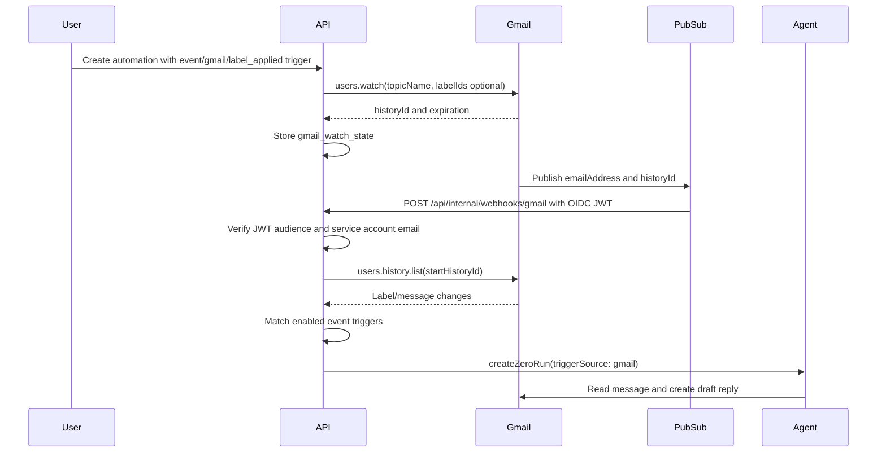

# Gmail Label Event Trigger Plan

Issue: https://github.com/vm0-ai/vm0/issues/17673

## Summary

Build the first native event trigger for automations: when a connected Gmail
account receives a specific label on a message, VM0 creates an automation run
that drafts a reply to that message. The production event source should be
Gmail push notifications through Google Cloud Pub/Sub, with OIDC-authenticated
push delivery into the API.

The core automation pipeline already exists:

```text
automation_triggers -> automations -> interpreter -> createZeroRun -> linked chat thread
```

The net-new work is the Gmail event ingestion layer:

```text
Gmail users.watch -> Pub/Sub topic -> push subscription -> API webhook
  -> Gmail history.list -> matching event trigger -> automation run
```

## External Requirements Confirmed

The following requirements come from Google's Gmail and Pub/Sub documentation:

- Gmail push notifications require a Cloud Pub/Sub topic.
- The topic must be in the same Google developer project that executes the
  `users.watch` request. For VM0, the OAuth client project observed in Cloud
  Console is `vm0-web`, so the topic must be under `projects/vm0-web/...`.
- Gmail publishes only a lightweight payload containing `emailAddress` and
  `historyId`; the API must call `users.history.list` with the stored user
  Gmail token to resolve the actual label/message changes.
- Gmail requires `watch` renewal at least every seven days. Google recommends
  daily renewal.
- Gmail's system service account
  `gmail-api-push@system.gserviceaccount.com` needs publish permission on the
  topic.
- Pub/Sub authenticated push sends an OIDC JWT. The API must validate the token
  signature and check `aud`, `email`, and `email_verified`.
- Pub/Sub's service agent
  `service-${PROJECT_NUMBER}@gcp-sa-pubsub.iam.gserviceaccount.com` needs
  permission to mint OIDC tokens for the push auth service account, normally via
  `roles/iam.serviceAccountTokenCreator` on that service account.
- The principal creating or updating the push subscription needs
  `iam.serviceAccounts.actAs` on the push auth service account.

References:

- Gmail push guide:
  https://developers.google.com/workspace/gmail/api/guides/push
- Gmail `users.watch` reference:
  https://developers.google.com/workspace/gmail/api/reference/rest/v1/users/watch
- Pub/Sub authenticated push:
  https://docs.cloud.google.com/pubsub/docs/authenticate-push-subscriptions

## GCP Resources To Configure

Use the OAuth client project, not the separate `vm0-ai` project.

Observed project:

- Project ID: `vm0-web`
- Project number: `656833730258`
- Existing OAuth clients in this project include the VM0 web OAuth client.
- Gmail API is enabled in this project.
- Pub/Sub API was enabled while inspecting the project.

Required resources:

1. Pub/Sub topic

   - Name: `projects/vm0-web/topics/gmail-label-events`
   - IAM: grant `roles/pubsub.publisher` on the topic to:
     `serviceAccount:gmail-api-push@system.gserviceaccount.com`

2. Push auth service account

   - Name: `gmail-pubsub-push@vm0-web.iam.gserviceaccount.com`
   - Purpose: OIDC identity used by Pub/Sub push requests to VM0.
   - This service account does not need application data permissions for the
     webhook use case. It is an identity for token signing and verification.

3. Pub/Sub service agent permission

   - Principal:
     `service-656833730258@gcp-sa-pubsub.iam.gserviceaccount.com`
   - Grant on the push auth service account:
     `roles/iam.serviceAccountTokenCreator`

4. Subscription creator permission

   - Whoever creates or updates the push subscription needs
     `iam.serviceAccounts.actAs` on
     `gmail-pubsub-push@vm0-web.iam.gserviceaccount.com`.
   - If a human operator creates it, grant that operator
     `roles/iam.serviceAccountUser` on the push auth service account.

5. Push subscription

   - Name: `projects/vm0-web/subscriptions/gmail-label-events-push`
   - Topic: `projects/vm0-web/topics/gmail-label-events`
   - Push endpoint:
     `https://<api-origin>/api/internal/webhooks/gmail`
   - OIDC service account:
     `gmail-pubsub-push@vm0-web.iam.gserviceaccount.com`
   - OIDC audience:
     `https://<api-origin>/api/internal/webhooks/gmail`, or a stable explicit
     audience value stored in env.

Do not create the push subscription until the API endpoint URL and expected
audience are finalized and deployed.

## Runtime Environment

Add explicit API env vars for the Gmail push integration:

- `GMAIL_PUBSUB_TOPIC_NAME=projects/vm0-web/topics/gmail-label-events`
- `GMAIL_PUBSUB_PUSH_AUDIENCE=<expected OIDC audience>`
- `GMAIL_PUBSUB_PUSH_SERVICE_ACCOUNT_EMAIL=gmail-pubsub-push@vm0-web.iam.gserviceaccount.com`

The API does not need a GCP service account to receive Pub/Sub push messages or
to call `users.watch`. `users.watch` is a Gmail API call made with the user's
stored Gmail OAuth token. A GCP service account is only needed if VM0 chooses to
manage Pub/Sub resources programmatically, which is not necessary for the first
slice.

## Repository Findings

### Automation trigger model

`packages/db/src/schema/automation.ts` already has:

- `automation_triggers.kind`
- `automation_triggers.config jsonb`
- automation owner identity on `automations.org_id/user_id`
- runtime state columns for time triggers

However, the DB check constraint only allows `cron`, `once`, `loop`, and
`webhook`. Migration `0449_spicy_raider.sql` adds this constraint. A Gmail event
trigger cannot be inserted by only writing new JSON config; the check constraint
must be replaced to allow the event trigger kind.

Recommended trigger shape:

```json
{
  "kind": "event",
  "config": {
    "provider": "gmail",
    "event": "label_applied",
    "labelId": "Label_123",
    "labelName": "Support"
  }
}
```

Use one generic `event` kind instead of a one-off `gmail_label` kind. This keeps
the automation trigger mechanism provider-neutral while shipping only Gmail in
the first implementation.

### API contracts and route projection

`packages/api-contracts/src/contracts/automations.ts` currently exposes only
the four existing trigger kinds. It needs:

- an `event` trigger request schema
- an `event` trigger response schema
- a Gmail event config schema for the first provider

`apps/api/src/signals/routes/automations.ts` currently maps only time and
webhook trigger rows. It needs a row-to-response branch for `kind === "event"`
with Gmail config validation.

Because this is a new integration capability, gate creation and dispatch behind
a new feature switch, for example:

```ts
FeatureSwitchKey.AutomationGmailEventTriggers
```

### Interpreter and run creation

`apps/api/src/signals/services/automations/default-interpreter.ts` already
documents the first fetching interpreter as the moment to replace the single
default implementation with a registry.

For this issue, keep the Gmail interpreter thin:

- The detector resolves only enough context to identify the triggering message:
  `messageId`, `threadId`, `labelId`, sender, subject, and snippet.
- The run prompt remains the automation instruction.
- The append system prompt supplies the Gmail event context and explicitly says
  to draft a reply, not send.
- `zeroRunMetadata` carries `automationId`, `triggerId`, and Gmail-specific
  event metadata if the run metadata model is extended.

The run should use `triggerSource: "gmail"`. This requires adding `"gmail"` to
`triggerSourceSchema` in `packages/api-contracts/src/contracts/logs.ts`. The
database field `zero_runs.trigger_source varchar(20)` is already long enough.

### Gmail connector and draft-only behavior

`packages/connectors/src/connectors/gmail.ts` uses
`https://www.googleapis.com/auth/gmail.modify`, which is sufficient for
Gmail watch, reading message history, labels, and draft creation.

The firewall generator already protects draft-only behavior:

- `gmail.compose` removes `drafts/send` and `messages/send`
- `gmail.send` is isolated as a separate permission

The automation should let the agent create a Gmail draft through the existing
connector/firewall path. The server should not create or send the reply itself.

### Server-side Gmail token use

This feature needs server-side use of the user's connector token for:

- calling `users.watch`
- calling `users.history.list`
- fetching message metadata if the interpreter needs sender/subject/snippet

Relevant existing pieces:

- `connectors` table stores connector metadata and external email.
- `secrets` stores connector secrets with `type = "connector"`.
- `zero-connector-data.service.ts` already resolves and decrypts connector
  secrets for connector management paths.
- `agent-webhook-firewall-auth.service.ts` already contains refresh-token
  connector refresh logic.

Recommended implementation: extract a narrow reusable service that resolves a
fresh Gmail access token for `(orgId, userId)`, reusing the existing connector
refresh metadata instead of adding a separate Gmail-only refresh path.

### API endpoint placement

New API endpoints must live in `apps/api`. Do not add Next.js
`apps/web/app/api/**/route.ts` handlers.

Recommended new endpoint:

```text
POST /api/internal/webhooks/gmail
```

If the Pub/Sub endpoint must be reachable on the web origin, add a rewrite in
`apps/web/api-backend-rewrites.js` that forwards this path to the API backend.

### Watch state

Store Gmail watch state outside individual automation trigger configs. A Gmail
watch is per mailbox registration, while multiple automation triggers may target
different labels for the same connected mailbox.

Add a table such as `gmail_watch_states`:

- `id`
- `org_id`
- `user_id`
- `connector_id`
- `email_address`
- `topic_name`
- `last_history_id`
- `watch_expiration_at`
- `last_watch_renewed_at`
- `needs_rewatch`
- `created_at`
- `updated_at`

Start with one watch per connected Gmail account and filter labels in the API
after `history.list`. If volume later justifies it, watch registration can be
optimized around label sets.

### Idempotency and history cursor

Pub/Sub and Gmail history delivery are at-least-once. Add idempotency at the
Gmail event layer:

- Store processed Pub/Sub `messageId` values, or store processed Gmail event
  keys derived from `(emailAddress, historyId, messageId, labelId, triggerId)`.
- Advance `last_history_id` only after all matching history entries are handled.
- If `history.list` reports the start history ID is too old or invalid, re-watch
  the mailbox, store the returned baseline history ID, mark the missed range in
  logs, and skip backfill for the first slice.

## Recommended Flow



## Implementation Slices

1. Schema and contracts

   - Add `event` to `automation_triggers_kind_config_check`.
   - Add typed Gmail event config validation.
   - Add `event` trigger schemas to the API contract.
   - Add `gmail` to `triggerSourceSchema`.
   - Add `gmail_watch_states` and event idempotency storage.

2. Gmail token and API client service

   - Resolve the user's connected Gmail row by `(orgId, userId, type = "gmail")`.
   - Reuse connector refresh metadata to obtain a fresh access token.
   - Implement `users.watch`, `users.history.list`, and message metadata fetch
     wrappers.

3. Gmail watch registration

   - On creating or enabling a Gmail event trigger, ensure the mailbox has an
     active watch against `GMAIL_PUBSUB_TOPIC_NAME`.
   - Store the returned `historyId` and expiration.
   - Add a cron route for daily watch renewal.

4. Pub/Sub push endpoint

   - Add `POST /api/internal/webhooks/gmail` in `apps/api`.
   - Verify Pub/Sub OIDC JWT.
   - Decode Pub/Sub message data.
   - Resolve watch state by `emailAddress`.
   - Call `history.list`, filter `labelAdded` events, and dispatch matching
     automations.
   - Add the web rewrite only if the subscription targets the web origin.

5. Gmail event interpreter

   - Add a small interpreter registry keyed by `automation.interpreterKind`, or
     keep the default interpreter and add a Gmail event branch if that is the
     smaller first slice.
   - Recommended: add a registry now because the file explicitly calls out Gmail
     as the first fetching interpreter.
   - Ensure the prompt and append system prompt make draft-only behavior clear.

6. CLI and product surface

   - Extend automation create/add-trigger display logic for `event` triggers.
   - Add UI/CLI label selection after the API path is stable.

## Test Strategy

Follow the repo's "mostly integration" testing guidance.

Add API entry-point integration tests around:

- Creating a Gmail event trigger validates config and requires a connected Gmail
  connector.
- The Pub/Sub endpoint rejects missing, invalid, wrong-audience, or wrong-email
  OIDC tokens.
- A valid Pub/Sub message decodes `emailAddress/historyId`, calls mocked Gmail
  `history.list`, matches a label-added event, and creates exactly one run.
- Duplicate Pub/Sub/Gmail history delivery does not create duplicate runs.
- Watch renewal calls `users.watch` and updates `historyId` and expiration.
- A stale Gmail history cursor re-watches and does not dispatch duplicate runs.

Mock only external boundaries:

- Google OAuth token/JWT verification
- Gmail HTTP APIs
- Pub/Sub push input

Use the real test database and existing API route harnesses.

## Final Decision

Use Pub/Sub push for the production design. Polling should not be the primary
implementation for this issue because the requested event trigger is naturally
event-driven, we already confirmed access to the OAuth client project, and the
GCP resource list is small and explicit.

The immediate GCP work that can be done before code ships is limited to the
topic, topic IAM, and push auth service account. The push subscription should
wait until the endpoint URL and OIDC audience are deployed and final.
