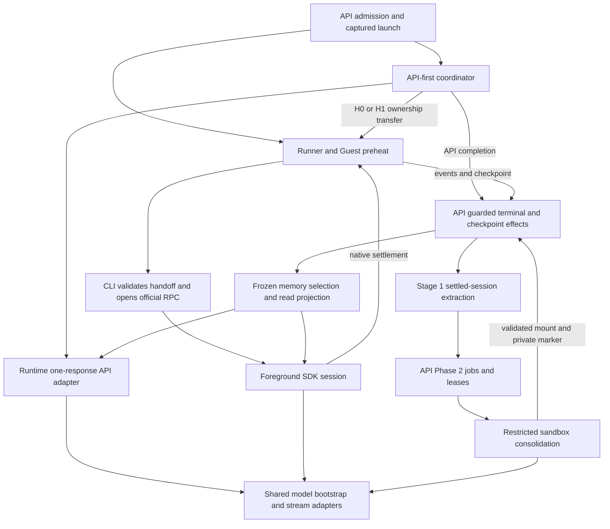

# Pi runtime architecture

This is the whole-system responsibility and compatibility map for
[#33519](https://github.com/vm0-ai/vm0/issues/33519). It describes execution and
memory boundaries consolidated by A–D, without defining a new harness,
route policy, wire format, or release gate. The linked source owns executable
behavior; the detailed contracts below own their respective implementation and
rollout rules.

## Authorities and dependencies

- [API-first transition contract](../turbo/apps/api/src/signals/services/pi-api-first-turn.md):
  decisions, request/publication ownership, guarded effects, and late usage.
- [Pinned SDK integration](../turbo/patches/pi-pending-tools.md): Pi **0.85.1**,
  pending tools, cancellation, next-response preparation, and session fixtures.
- [Bash spool contract](../turbo/packages/pi-agent-runtime/bash-spool-backpressure.md):
  actual local-tool consumers, backpressure, interruption, and verification.
- [Deployment compatibility](./deployment-compatibility.md): independently
  deployed API/Runner/Sandbox, commit-addressed CLI, history, and memory readers.
- [Native provider preparation](./pi-native-provider-preparation.md): native
  transport, credential/billing ownership, and the original activation gates.
  Current admission remains owned by the API source, not that preparation ledger.
- [Memory/citation provenance](../turbo/packages/pi-agent-runtime/src/memory-recall-upstream.md)
  and [delimiter boundary](./citation-delimiter-literals.md): canonical parser,
  derived text, historical reads, and upstream attribution.

Arrows describe calls or transfer of validated data, not shared cancellation or
accounting ownership. Pure route/policy/projection modules never import API
services or a command accessor.

| Responsibility                      | Source and dependency boundary                                                                                                                                                                                                                                                                                                                                                                                                                                                                                                                                                                                                                                                               |
| ----------------------------------- | -------------------------------------------------------------------------------------------------------------------------------------------------------------------------------------------------------------------------------------------------------------------------------------------------------------------------------------------------------------------------------------------------------------------------------------------------------------------------------------------------------------------------------------------------------------------------------------------------------------------------------------------------------------------------------------------- |
| Admission and captured identity     | [pi-sandbox-config.ts](../turbo/apps/api/src/signals/services/pi-sandbox-config.ts), [agent-run-create.service.ts](../turbo/apps/api/src/signals/services/agent-run-create.service.ts), and [dispatch](../turbo/apps/api/src/signals/services/pi-api-first-turn-dispatch.service.ts) fence eligible sources and capture `piModelConfig`. Chat, callbacks, and workflow launch use the same admission policy.                                                                                                                                                                                                                                                                                 |
| Route normalization and credentials | [execution-route.ts](../turbo/packages/pi-agent-runtime/src/execution-route.ts) normalizes supported carriers into the in-process `PiExecutionRoute`; [credential.ts](../turbo/packages/pi-agent-runtime/src/credential.ts) snapshots it before asynchronous materialization. The original wire remains authoritative for claim capability and telemetry. Credential references are captured; secrets are materialized only at the API or firewall execution edge.                                                                                                                                                                                                                           |
| API-first ownership                 | [registration](../turbo/apps/api/src/signals/services/pi-api-first-turn-registration.service.ts) owns cancellation registration/release; [coordinator](../turbo/apps/api/src/signals/services/pi-api-first-turn.service.ts) owns preparation and guarded effects; [policy](../turbo/apps/api/src/lib/pi-api-first-turn-policy.ts) receives immutable facts. The [lifecycle lock](../turbo/apps/api/src/signals/services/pi-api-first-turn-lifecycle.service.ts) is shared with cancellation and active-input reservation.                                                                                                                                                                    |
| SDK model boundary                  | [session-model.ts](../turbo/packages/pi-agent-runtime/src/session-model.ts) owns explicit resource-registry initialization, registered model description, and fixed `ModelRuntime` bootstrap. [model.ts](../turbo/packages/pi-agent-runtime/src/model.ts), [native-stream.ts](../turbo/packages/pi-agent-runtime/src/native-stream.ts), and [native-http.ts](../turbo/packages/pi-agent-runtime/src/native-http.ts) own catalog/transport adaptation and request guards.                                                                                                                                                                                                                     |
| Session shells                      | [session-runtime.ts](../turbo/packages/pi-agent-runtime/src/session-runtime.ts) owns foreground settings, resources, tools, harness prompt, and persisted thinking precedence. [phase2-memory.ts](../turbo/packages/pi-agent-runtime/src/phase2-memory.ts) owns the separate restricted session, caller/model arbitration, validation, and cleanup.                                                                                                                                                                                                                                                                                                                                          |
| API history and one response        | [session-memory.ts](../turbo/packages/pi-agent-runtime/src/session-memory.ts) adapts byte-backed history through official parser/context helpers. [api-turn.ts](../turbo/packages/pi-agent-runtime/src/api-turn.ts) borrows the foreground shell's prompt/tool schemas, makes one model response, and disposes the shell. It never executes the returned tools.                                                                                                                                                                                                                                                                                                                              |
| Sandbox execution                   | [CLI loop](../turbo/apps/cli/src/lib/pi-agent-loop.ts) consumes private launch data, validates the [handoff](../turbo/apps/cli/src/lib/pi-api-first-turn-handoff.ts), then enters [rpc.ts](../turbo/packages/pi-agent-runtime/src/rpc.ts). [Guest Pi RPC](../crates/guest-agent/src/cli/pi_rpc.rs) owns the process/transport adapter and public settlement projection; the official SDK owns tools and its native input queues.                                                                                                                                                                                                                                                             |
| Memory work and publication         | [Stage 1 worker](../turbo/apps/api/src/signals/services/pi-memory-stage1-worker.service.ts) owns extraction claims; [Phase 2 worker](../turbo/apps/api/src/signals/services/pi-memory-phase2-worker.service.ts) and [jobs](../turbo/apps/api/src/signals/services/pi-memory-phase2-job.service.ts) own durable leases. [Local filesystem boundary](../turbo/packages/pi-agent-runtime/src/phase2-memory-filesystem.ts) prepares/applies validated bytes; ordinary checkpoint publication owns durable Storage changes. [Maintenance completion](../turbo/apps/api/src/signals/services/pi-memory-phase2-maintenance.service.ts) observes the exact run/checkpoint, not a new Storage writer. |
| Public projection and accounting    | [API events](../turbo/apps/api/src/lib/pi-api-first-turn-events.ts) and Guest project public content/usage. [API attempt usage](../turbo/apps/api/src/signals/services/pi-api-first-turn-usage.service.ts), [Stage 1 usage](../turbo/apps/api/src/signals/services/pi-memory-stage1-usage.service.ts), and Runner/proxy ingestion retain their separate request owners. Public token counters are not the billing journal.                                                                                                                                                                                                                                                                   |

Product model selection, SDK catalog identity, upstream request model or Bedrock
inference profile, credential/account owner, and billing owner are distinct.
The captured route carries that meaning through API and Sandbox; adapters do not
reselect a provider or infer a different account from a model name. Native
destination/DNS/redirect checks, explicit headers, firewall placeholders,
subscription account binding, and dialect-specific tier policy remain at their
existing trust boundaries.

## Launch through settlement

1. The API admits and freezes the run's route, source, session, resources, and
   CLI artifact. Runner/Guest preheat prepares the existing sandbox boundary.
   H0 is the authenticated base history; H1 includes the single API response;
   H2 is the subsequent sandbox checkpoint. These labels describe ownership,
   not additional session formats.
2. API-first authenticates history and the immutable resource snapshot. Blob
   metadata selects large-history sandbox transfer before materializing H0 or
   loading API resources. The API response budget and later coordination cap
   remain separate deadlines. Existing raw/encoded limits and compaction
   preflight remain unchanged; detailed limits belong to deployment/SDK notes.
3. Immediately before provider transport, the shared lifecycle lock rechecks
   durable status, launch identity, and active delivery. Active input can select
   H0 transfer before a request. `ownership.stage` records the irreversible
   provider-request boundary. The API makes one response, collecting native
   history and projected content without running local tools.
4. Before the first H1 publication effect, locked revalidation marks
   `commitProgress.started`. Pending tools take precedence; settled H1 with
   accepted active input transfers as a new prompt; otherwise API completion
   commits once. H0 readback/hash verification and manifest publication retain
   their existing lock scope. Once publication may have started, recovery cannot
   replay H0, including a published manifest whose response was lost.
5. Eligible pre-commit API/model failures retain the specified **same-route**
   sandbox recovery. Failure classification precedes private attempt abort;
   cleanup cancellation cannot manufacture deadline eligibility. Canonical
   cancellation and terminal status are reread under the lock. Prepared-sandbox
   cleanup stays with its existing owner.
6. CLI validates the immutable manifest, session identity/hash, and transfer
   mode, then writes the private boundary control before any official RPC event.
   `sandbox-first` executes the prompt; `pending-tool-continuation` continues
   only unresolved native calls; `settled-session-continuation` acknowledges the
   installed H1 before ordinary queued input. Neither continuation re-appends
   the API assistant or replays its original user prompt.
7. Native Agent and AgentSession ownership precede the pending-tool startup ACK.
   Tools, steering/follow-up queues, retry/compaction, and awaited extension
   settlement remain SDK responsibilities. Accepted input is reconciled before
   the sole public `agent_settled`; cancellation persists accepted input without
   starting a new turn. Guest keeps stdin open through terminal handling and
   active-input quiescence, and owns its existing abort-ACK deadline and process
   termination/reaping. Cooperative cancellation cannot roll back external tool
   effects or force an uncooperative tool to finish instantly.
8. Guest/Runner deliver public events and the ordinary checkpoint; API durable
   terminal guards arbitrate completion. A raw `agent_end`, callback delivery,
   usage receipt, or local prepared result is not another terminal/publication
   authority. An owned late-result observer may record actual API usage under
   the original response/category idempotency, but cannot publish output,
   checkpoint, or a second terminal event.

## Shared bootstrap, distinct session policies

`createPiModelRuntime` receives the **already-resolved model**, captured stream
configuration, and caller-selected credentials/signal. It fixes
`allowModelNetwork: false`, `modelsPath: null`, and `refreshOnCreate: false`, then
registers that model. This disables model catalog networking/file discovery and
startup refresh; it does not disable the intended inference request or change
SDK registration's existing local refresh behavior.

| Entry                                               | Credential and cancellation policy                                                                                                    | Session policy                                                                                                                                                                                    |
| --------------------------------------------------- | ------------------------------------------------------------------------------------------------------------------------------------- | ------------------------------------------------------------------------------------------------------------------------------------------------------------------------------------------------- |
| API with preheated snapshot                         | Explicit `InMemoryCredentialStore`; the API attempt still owns its transport signal. Bootstrap adds no foreground cancellation owner. | Trusted in-memory settings and frozen resources; one response; no local pending-tool execution.                                                                                                   |
| Native foreground Messages/Bedrock without snapshot | Explicit in-memory credentials; captured native materialization remains authoritative.                                                | Existing foreground settings, resource behavior, and lifecycle.                                                                                                                                   |
| Other foreground Sandbox without snapshot           | Omit explicit credentials, preserving the SDK's existing default store.                                                               | File-backed production history, normal discovery, and persisted thinking precedence.                                                                                                              |
| Restricted Phase 2                                  | Explicit in-memory credentials; the exact input signal goes to ModelRuntime and `services.modelRuntimeSignal`.                        | In-memory session at fixed private cwd, restricted tools, no discovered extensions/skills/prompts/themes/context files, disabled retry/compaction, fixed reasoning, exact system-prompt equality. |

Model lookup and error classification stay with each caller. Phase 2 applies
[#33567](https://github.com/vm0-ai/vm0/issues/33567)'s existing maintenance-only
catalog correction **once**, then passes the same corrected model to registration
and session construction. Bootstrap never resolves it again. Foreground catalog
resolution remains unchanged.

Both callers explicitly initialize the shared session-resource registry at the
start of their existing shell, before their previous asynchronous preparation.
Its register/unregister pair ensures eager disposal works under Vite SSR; it
does not establish another resource lifetime. Service/session creation,
disposal, tools, settings, and resource loaders remain local to their owners.

The package's [root](../turbo/packages/pi-agent-runtime/src/index.ts) and
[/api](../turbo/packages/pi-agent-runtime/src/api.ts) expose Okou structural
types. [/node](../turbo/packages/pi-agent-runtime/src/node.ts) is the native
SDK/CLI boundary. The [public declaration checker](../turbo/packages/pi-agent-runtime/scripts/check-public-declarations.mjs)
walks the root and `/api` declaration closures and their resolved TypeScript
dependencies, rejecting upstream SDK leakage; `/node` is deliberately excluded.
Clean declarations do not mean the API implementation has no SDK dependency.
The internal bootstrap is not added to any public entry point.

API byte-backed history and Sandbox's official `SessionManager` have different
storage owners. The former uses exported parsing/migration/context helpers
without asking an SDK file loader to rewrite the source; the latter owns native
file persistence. `rpc.ts` synchronously validates UTF-8, structure, and identity
before `SessionManager.open` can migrate a file, then validates loaded entries
before traversal. A universal session factory would hide these distinctions.

## Extraction, consolidation, and reading

Stage 1 operates asynchronously on settled-session history. The API worker
authenticates/decompresses the source, excludes active or ineligible sources,
projects/redacts/truncates within its existing bounds, runs
[stage1-memory.ts](../turbo/packages/pi-agent-runtime/src/stage1-memory.ts), and
commits a candidate under its claim fence. Its work unit and usage owner are
separate from a foreground response and a Phase 2 storage consolidation.

The Phase 2 API worker claims a storage revision/base/selection and dispatches a
private maintenance run. It renews the **real database lease** against the
maintenance run/token. The local engine has no fabricated user/org identity,
heartbeat callback, lease scheduler, or database publication authority. It
snapshots owned bytes, stages a private workspace, executes the restricted SDK
session, validates outputs, awaits cancellation/settlement and cleanup, and
returns prepared bytes. There is no same-process Base64 transport roundtrip.

The mounted boundary authenticates the exact base and selection, rechecks path,
symlink, collision, immutable-file, size/hash and final identity constraints, and
applies only a validated result. CLI writes the private validation marker only
after that succeeds. Ordinary terminal artifact publication validates the marker
and ownership fences; [checkpoint receipts](../turbo/apps/api/src/signals/services/pi-memory-phase2-checkpoint.service.ts)
are recorded inside that commit transaction. Completion observes the exact
checkpoint/lineage/receipt; callback delivery alone proves none of these effects.

Recall freezes a Storage version and source identity per run. Shared
[memory-recall.ts](../turbo/packages/pi-agent-runtime/src/memory-recall.ts) and
[memory-recall-node.ts](../turbo/packages/pi-agent-runtime/src/memory-recall-node.ts)
authenticate the full source, then inject the bounded excerpt. Stored-summary
size and injected-summary token budget are distinct; their authoritative
reader/producer contract is in deployment compatibility. Memory tools retain
the frozen epoch and explicit ad-hoc-note request boundary. Local note staging
is not a durable checkpoint.

API attempts and Stage 1 retain their own usage writers. Sandbox foreground and
Phase 2 inference use Runner/proxy accounting; runtime Phase 2 usage in a result
is evidence, not a second journal. [Phase 2 usage binding](../turbo/apps/api/src/signals/services/pi-memory-phase2-usage.service.ts)
survives the existing execution/finalization drain for late proxy usage, including
failed/revoked attempts. The shared [model usage thresholds](../turbo/packages/api-contracts/src/contracts/model-price-tiers.ts)
and their [Python generation](../turbo/packages/api-contracts/src/python-bindings/generate.ts)
remain authoritative for API and [proxy classification](../crates/runner/mitm-addon/src/usage/providers/model_provider.py).
Existing pricing owners remain unchanged; public event fixtures do not replace billing classification,
raw usage, or compacted rollup reconciliation.

## Retained compatibility and retirement evidence

Versions below name different dimensions. A higher model generation does not
retire an older launch, resource, manifest, session, or persisted reader.

| Surface and actual consumers                                                                                                                                                                                                                              | Why retained                                                                                                                                                                | Decisive gate and authority                                                                                                                                                                                                                                                                                                       |
| --------------------------------------------------------------------------------------------------------------------------------------------------------------------------------------------------------------------------------------------------------- | --------------------------------------------------------------------------------------------------------------------------------------------------------------------------- | --------------------------------------------------------------------------------------------------------------------------------------------------------------------------------------------------------------------------------------------------------------------------------------------------------------------------------- |
| Model carriers Gen1–Gen4: [runners.ts](../turbo/packages/api-contracts/src/contracts/runners.ts), native schema, route normalizer, [claim capability](../turbo/apps/api/src/signals/services/pi-model-config-claim-capability.ts), CLI and Runner readers | Gen1 without `api` remains supported; historical optional `api` literals normalize to public Responses. Gen2/3 dialect/tier and Gen4 native ownership are active contracts. | [#31085](https://github.com/vm0-ai/vm0/issues/31085) owns removal of only obsolete Gen1 field compatibility. It requires healthy writer-cutoff deployment, compatible rollback targets, complete executable-context/caller census, and Runner/Sandbox/pinned-artifact drain. It does not retire Gen1 or the active Codex dialect. |
| Launch snapshot V3, Pi launch config V2, private payload V1, maintenance input V1; API creation, Runner serialization and CLI parsing                                                                                                                     | Run identity and private inputs have their own strict schemas and captured lifetimes.                                                                                       | Audit each writer/reader and all supported old/new pairs before changing its shape; [deployment compatibility](./deployment-compatibility.md) governs release, queue, process and rollback evidence. D changes none.                                                                                                              |
| Resource snapshots V1/V2; [snapshot service](../turbo/apps/api/src/signals/services/pi-resource-snapshot.service.ts), [resources.ts](../turbo/packages/pi-agent-runtime/src/resources.ts), API foreground shell                                           | V2 adds frozen recall; both snapshots still describe admitted immutable resources. B derives runtime types from these contracts.                                            | Retire only with proof all captured contexts and supported readers/rollback paths use the replacement; schema numbering or absent sampled traffic is insufficient.                                                                                                                                                                |
| Handoff manifests V3/V4, API-first config V1, Guest boundary control V2; API publisher, CLI resolver, Guest                                                                                                                                               | V3 carries small H0 or API H1; V4 references larger H0 for sandbox-only download. Three ownership modes remain explicit.                                                    | Preserve until producer, captured-context, pinned CLI and Guest/rollback evidence proves replacement compatibility. Detailed history limits and rollback behavior remain in deployment compatibility.                                                                                                                             |
| Commit-addressed CLI and queued/active contexts; API context writer, Runner launcher, CLI package                                                                                                                                                         | A current Runner can launch an older package frozen when a context was created. Semantic package version alone is not an artifact floor.                                    | Maximum queue plus claimed execution/finalization lifetime, complete old-context drain and supported external-caller audit, separately from Runner/Sandbox and rollback-target retirement. No blanket elapsed-time gate.                                                                                                          |
| Session v3; byte-backed API adapter, SDK file reader, checkpoint/Stage 1/export readers                                                                                                                                                                   | Branches, compaction and pending tools must retain native meaning and source identity.                                                                                      | [0.84.1/0.85.1 session fixtures](../turbo/packages/pi-agent-runtime/src/session-version-compatibility.test.ts) prove representative compatibility, not fleet drain or historical replay. Any replacement needs supported-reader and retained-history evidence, not just a newer SDK.                                              |
| Old-Guest raw citation bridge in [pi-memory-citation-events.ts](../turbo/apps/api/src/signals/services/pi-memory-citation-events.ts), called by [agent-webhook-events.service.ts](../turbo/apps/api/src/signals/services/agent-webhook-events.service.ts) | Older Guest events can need raw-envelope projection before structured provenance persistence.                                                                               | [#31964](https://github.com/vm0-ai/vm0/issues/31964) alone owns bridge removal: successful #31959 API/Runner release, pre-release process drain through the two-hour budget plus bounded finalization, and sanitized structured output from retained rollback Runners.                                                            |
| Historical citation/text defenses and private provenance; API chat/Snapshot/search/callback reads, browser cache, raw-history export derivatives, [user-export.service.ts](../turbo/apps/api/src/signals/services/user-export.service.ts)                 | Immutable historical rows/blobs remain supported reads. User export still reads `piMemoryPublicationProvenance`; source JSONL is not rewritten.                             | These are separate from the rollout-only old-Guest bridge. #31964 does not authorize removal. A later explicit historical-data/export contract would be required; [provenance note](../turbo/packages/pi-agent-runtime/src/memory-recall-upstream.md) and delimiter contract remain authoritative.                                |

At D's source review on 2026-09-12, #31085 and #31964 were OPEN with their
respective removal gates unresolved. This refactor, its merge, representative
fixtures, and passage of time do not satisfy those externally owned gates.

### Pinned patch inventory

[pnpm-workspace.yaml](../turbo/pnpm-workspace.yaml) pins the three actual 0.85.1
patches. SDK version, dependency lock, and patch hashes are unchanged by D.

| Patch / actual consumer                                                                                                                                           | Retained behavior and replacement evidence                                                                                                                                                                                                                                                                                                                                                                                                                                                                                           |
| ----------------------------------------------------------------------------------------------------------------------------------------------------------------- | ------------------------------------------------------------------------------------------------------------------------------------------------------------------------------------------------------------------------------------------------------------------------------------------------------------------------------------------------------------------------------------------------------------------------------------------------------------------------------------------------------------------------------------ |
| [pi-agent-core](../turbo/patches/@earendil-works__pi-agent-core@0.85.1.patch): native loop/Agent reached through `rpc.ts` and `AgentSession.continuePendingTools` | Unresolved suffix execution without transcript replay; native ownership before ACK; joined tools/events, queue admission and cancellation reconciliation through sole settlement. Replace only with an upstream public API proving these same real-session/RPC contracts. The [SDK note](../turbo/patches/pi-pending-tools.md) owns the exact semantics.                                                                                                                                                                             |
| [pi-coding-agent](../turbo/patches/@earendil-works__pi-coding-agent@0.85.1.patch): AgentSession continuation and pre-response preparation                         | Await settlement extensions once while busy, flush native custom messages, retain `lastCompletedTurn`, and propagate cancellation through next-response compaction/auth/retry/preparation. Keep matching JS/declarations and cancellation/session fixtures until a pinned upstream replacement passes them. No new state machine or replay journal.                                                                                                                                                                                  |
| Same coding-agent patch: official local Bash tool, `OutputAccumulator`, shared child-process helper                                                               | Pace both pipes through spool drain and final flush; preserve caller timeout, abort, process cleanup, byte order, and complete-file success. `core/exec.js` still calls the helper without drain options; `AgentSession.executeBash` uses the independent executor. These supported callers justify optional helper arguments, not a claim that every executor is paced. Retirement requires the [real child/file spool regressions](../turbo/packages/pi-agent-runtime/bash-spool-backpressure.md) against an upstream replacement. |
| Same coding-agent patch: Photon import, image resizing, packed CLI worker/fallback                                                                                | Normalize the CJS default import while preserving worker and fallback behavior. [CLI bundling](../turbo/apps/cli/tsup.config.ts) ships the image worker and WASM. Removal requires verified upstream interop plus actual packed CLI image/worker/fallback execution; a source-only import check is insufficient.                                                                                                                                                                                                                     |
| [pi-ai](../turbo/patches/@earendil-works__pi-ai@0.85.1.patch): Bedrock adapter via `native-stream.ts`                                                             | Explicit `clientConfig` bypasses ambient auth/region discovery, carries response identity, and destroys the client. Upstream direct SDK callers without that option still use the retained default branch. Replace only when the upstream API preserves explicit edge configuration, cleanup and native stream tests for all supported callers.                                                                                                                                                                                      |
| Same pi-ai patch: Codex Responses via `model.ts`                                                                                                                  | Explicit selected `accountId` wins over JWT extraction. Current Okou binding remains mandatory; the upstream JWT fallback still serves SDK callers such as summarization auth paths that omit this additive option. Its comment names [#31373](https://github.com/vm0-ai/vm0/issues/31373): remove only after every supported caller supplies explicit identity and the recorded Runner/Sandbox drain passes. Closure of a delivery issue alone is not that caller proof.                                                            |

A bounded upstream follow-up is to provide supported unresolved-tool continuation
with native awaited settlement/cancellation and explicit provider/account
configuration matching these fixtures. No upstream issue or SDK release is a
prerequisite for this internal bootstrap consolidation.

## Disposition of the A–D recommendations

| Recommendation from #33519                                                    | Disposition and evidence                                                                                                                                                                                                                                                                                                                          |
| ----------------------------------------------------------------------------- | ------------------------------------------------------------------------------------------------------------------------------------------------------------------------------------------------------------------------------------------------------------------------------------------------------------------------------------------------- |
| Remove simulated Phase 2 orchestration                                        | **A delivered**, [#33521 / #33547](https://github.com/vm0-ai/vm0/pull/33547): local consolidation replaced fake identity/always-true heartbeat/observer machinery; unused API heartbeat export removed. Real database lease, checkpoint and cancellation owners remain.                                                                           |
| Remove local transport and redundant byte copies                              | **A delivered**: owned local bytes replace the Base64 roundtrip; synchronous input/prepared snapshotting and mounted revalidation preserve trust boundaries. No OOM cause or historical recovery claim.                                                                                                                                           |
| Canonicalize frozen route meaning and invalid combinations                    | **B delivered**, [#33556 / #33558](https://github.com/vm0-ai/vm0/pull/33558): `PiExecutionRoute`, discriminated dialect/auth types, one edge materializer, native placeholder construction, and route-based metadata/accounting inputs. Wire-generation branches remain for real claims and compatibility readers.                                |
| Share registry initialization and model registration description              | **A delivered**, with B's typed stream integration: `initializePiSessionResourceRegistry` and `registeredModelConfig` already lived in `session-model.ts`. D reuses them; they are not new D work.                                                                                                                                                |
| Share selection digest and resource contracts                                 | **A delivered** `phase2-memory-selection.ts`, consumed by API jobs/worker and local filesystem. **B delivered** `api-types.ts` aliases derived from existing resource/recall contracts. No duplicate encoder or schema is introduced by D.                                                                                                        |
| Separate API-first decisions from effects                                     | **C delivered**, [#33570 / #33580](https://github.com/vm0-ai/vm0/pull/33580): pure history/H1/recovery/terminal policy plus guarded effects. Preparation and effects intentionally remain adjacent because they share authenticated H0/launch identity; registration and lifecycle lock keep their own responsibilities.                          |
| Consolidate cross-language public events and billing policy where appropriate | **C delivered** fixed [public-event fixtures](../fixtures/pi-public-events.json) through real API/runtime/Guest producers; shared citation fixtures remain. API attempts and proxy accounting intentionally remain independent, with existing generated price/threshold contracts. Sharing public counters never creates a second billing writer. |
| Remove remaining identical SDK setup                                          | **D delivered**, [#33581](https://github.com/vm0-ai/vm0/issues/33581): one internal fixed ModelRuntime bootstrap takes the caller's resolved model and explicit credential/signal choice. Foreground and restricted session shells stay separate for the policies above.                                                                          |
| Document SDK adapters, compatibility readers, patches and ownership           | **D delivered** by this indexed overview and linked detailed authorities. Byte-backed API history, official file/RPC adapters, native pending-tool/cancellation patches, and historical exports are intentionally retained with actual consumers and gates above.                                                                                 |
| Avoid duplicate ownership and unbounded follow-ups                            | **Externally owned**: #31085, #31964, #33351/#33560, #33069, #32963, #33567 and model-aware effort work. D preserves their current code and does not claim context/summary/concurrency, recovery, OOM, admission or rollout completion.                                                                                                           |

A/B/C have independent controller acceptance recorded on the parent:
[A](https://github.com/vm0-ai/vm0/issues/33519#issuecomment-5636139079),
[B](https://github.com/vm0-ai/vm0/issues/33519#issuecomment-5638163894),
[C](https://github.com/vm0-ai/vm0/issues/33519#issuecomment-5640227662).
Those are dated code/verification records. D9, full EPIC acceptance, exact
authorized release inclusion and production verification remain the controller's
separate work; this document does not certify them. D introduces no migration,
backfill, historical replay, production rewrite, or new waiting gate between
code-only slices.

## Verification boundary

Use the real runtime session/model/API/Phase 2 tests, externally controlled
provider requests, temporary files, native RPC/cancellation tests, and session
compatibility fixtures. Existing Phase 2 tests observe restricted tools/prompt,
abort/cleanup, and the corrected context's serialized output ceiling; they must
continue to catch re-resolution to the stale catalog. Foreground tests preserve
captured route/headers/account/tier and persisted thinking. CLI handoff/loop and
API/Guest common-event consumers cover the neighboring edges.

Run affected formatting, types, lint, Knip, build/public declarations and required
CI. A bundle change also requires the actual packed CLI/Photon path. Keep one
local Vitest process at a time and bounded logs; use the repository's
[testing guidance](./testing.md). Record exact revisions and actual execution in
the PR, distinguishing unselected/skipped/environment-limited checks and older
fixture evidence from current-head passes. None of these local/CI checks is
production release or fleet-drain evidence.
